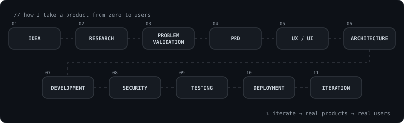

<!-- ═══════════════════════════ HEADER ═══════════════════════════ -->
<div align="center">


<a href="https://github.com/YOUR_USERNAME">
  
</a>

<br/>


<br/><br/>


</div>

<br/>

<!-- ═══════════════════════════ PORTRAIT ═══════════════════════════ -->
<div align="center">
  
</div>

<br/>

<details>
<summary><b>▸ Prefer plain text? Open the raw ASCII portrait</b></summary>

```text


                                                       =====+*+++=
                                       =--==--+*+===+*+-+*+=+**+=++++++=
                                  ==--====++=+**+**++=*#*+++===-+*+*#****+++===
                              --===+==--==+*++****-=+*++=---=-=-:+*++==++***++++=====
                         ------=+*+=:===++=+==**+++=-=::-=::=-=--==+-:-+==-=-+++++++*+++
                       -------==+++-:=--+=--=:-+-::-===++::+*#===*==-::---+-:----==*+++++=
                      ----====+*+==-==++#+=-..:++=:::-=====+-++=++==-..:==#=-.--::-=++++++*
                     ---==++*#**+--=-:=%#=....:--:.......::-:....-+*+--=**+*+++-::---=+=+##*+
                    ----=+*++++*-...:=%#=..--*#-==-........:=-...::.::-*#+*+=+*===-.:::-=*#*+++
                   --===*#+*=+*:....-%%=:=:.-%*=--=:..--=+==+#-::=:-=+*+-.::=*.:++==-..-::=*##++
                   --=*#==*##%*:...-#%+::::+:..=#*=----*+***+-==--=..:::=*-.==.:=+++**:.::=+++**++
                  -=+#%**+-+%%=--:=##+-:-::::-...=**==++*#*++*=-.::==--=+%+:....=+=-=+#+-.=+*-****+
                 ==+#%##=-+##+##*=+%%#+==*+=::....:=+++:..=*+====-::::-=+:..-:::=+:.::-*******=-##++
                =+*%%#%#==+=*#%*+*@@@%**#+--==-.:.--*+=-...:-=+++=-:---:.::..:=++---::.-+#%##*++-=+*
                =*##%##=::=***=+=*###*+++:-**=+::=-::=+=:....==........:--.........::--++=**=*##+-==+
                *+*+*=:...--++::=+*%%*#*-=##*+=--:.:...::.:-:......-=+=-+=+=.:::...+-..:+##%#---+*=-=
                **-::.....-:::.+%+*=+#%#+##----:::::..---+=--....:==+%*+--++-.-.:-=:-----+#*#*-:-:-=+
                =-.:-.........=*+..*%%%#+=.......::..:+=+%*=*=+=.:++*=:...-==:..:=:..-*:-:-=-=*+=::-=+
                =:..:.........-=*..:.:-:............:+*+==+++==--+*-....-+#:...---....:=-...==-::-..-*
                =.-.........:...+*...-+-:...........--:.:...:-=-==:..==:=*+:-.:+*-=......:::=+=:::-:+
                =--........:::-::==:-.-:=+-..:==-....-:.:::::===+=::.-****#=-.:+*=*+=+.....-=:.....-
                =+=........:-:--=+*+=-..:::===-:....:==++=-+++++-...-:-=***-..:--=*+#=...::--:....:+
                -==.......--:--==*####*.::.:....-:.::-=-:::..-:......::=---=:....:+--++-+++=:....:=
                --+*+=...:=--:--+#%%%%##+-:---====+====---::::===.....:-=:.......-=:.:*++-::..::=+
                :*%*##*-.=*=-:-=#%@@%@@@#*+==--:....-=+##**#%###*+....===-::..:---:::-==++...:+++
                -%+=***++*##=--*@@@@@@%##***++++=:......:+#%%%##*-...:=-.-:--:::--=++--===-:-=+**
                **=#@#***#%#*=+%@@@@@%%#*++=-=====-::--:..-+==++-.:::.:-..:........::=+*=--=+***
                #+#%##**++#%#*%@@@@@%#*+=--:---::..::::=++++++++-::-::..............:::+*:-==++
                **%*==--=+%%*#@@@@@@%#+=--:--+-....=+-::-=+++***+-..--:-::....:-===++++++-+#==
                +##=--==*@@%*%@@@@@@%##*+======-::===:..:-=++*#*+=-:..........:===-=+**#+*%%+
                -%%=:-=+%#@%#%%@@@@@@@%#**++=---::::...:-=+++*#*+--:..........:*-:=-=+#%**+=
                .#**++==++%#*#%%%@@@@@@%%#***+==--:::--=++**#%%#*=-:........:=##*=--=+#%*-=:
                .=%#%@#=-=##*##%%%%@@@%%##***++===-==+***##@@@@%#*+-:.:....:-===++***#%#*+:
                .:#@%#*+**+%#####%%%###*****+++++**####%%@@@@@@%##*===------===+*##%%%@#*:.
                :::*%##*+++%%%%####*********###%%%%%###%%@@@@@@@%%#*+++*+===+*#%%%@@@@@#-:
                 :::=****+=#%%%###****+***##%%%%%####**#%%@@@@@@%@%%*++*###**#%%@@@@@@%+::
                       ---*%%%%#****+***##%%%%%%%##*++*%@@@@@@@%%%%%#++#%%%%%%%%%%%%%%*-::
                        ::+%@%%#******##%%%%%%%%##**+=%@@%#**##******%#*#%%%@@%%%####*-:-
                         .-%%%%##*####%%%%%@@%%%####*=*=:....==--:..-+**##%%%%##**++*=--
                          -#%%%#######%%%%@@@@@%%%%%##*=:-==-:......:+#########*+==+-::
                          -########%%%%%@@%@@@@@@%%%#**+=:....:..:=#%@@%%%#####*+=+-:::
                          -###*####%%%%%%%%%%%#+===---::..........:+#%@@%%%###**===:::
                         ::#*+*###%%%%%%%%%%#+-:.:-===::::--=++=:-..:=*#%%%#***++=:::
                         ::%#+=**######%%%%#+-:..........:::::....:-::.:=##***++=:::
                        :::%%#+=+***#######**++++=---===:...............-*#****+:::
                        ..:%%#*+-=+**#**##****#####*++**##**###*+-....::=****+-:::
                       .::+%%##*+-:-+**####*###*#*##**+===+++====+*#*+=+***++-::::
                       :+%#%%##*++-:-=+##%%####****++==:....::-=+****+++*++-:::::
                      -*@*+%%#***++=---+#%%%%%%%%#**++=-::.::--==+*+***+=-::::::
                     :=@@#*%%#***+++==+--*#%%%%%%%%%%%#***+******####*+-::::----
                    -:@@@@#%##***++++++=-:-===++***###*+++*#%%%%%%%#**+::::----
                  *+-=@@@@@###***+++++++=-....:::-::---::-===+***+==*#@=::-----
                *++=-.+@@@@@%****+++*+++==:..............::..::...=*###@-----=
              **+=-::..*@@@@@@#*+++***+++===-:...................+*###*@#---==
            **++==-:::..*@@@@@@@#*+++***+++++++=--:...........:=+*###=+@@--===
           +==----:::::..+@@@@@@@@%*++++++++++++*++=---::::-=++**###*.*@@=:==+++=
         +=--:-:::::::....=%@@@@@@@@@#*++++++++**+++++===+++*****##*:.#@@#.-=====++=
      +++==----::-::::::...=%@@@@@@@@@@%#+======+++++++===++****#*+:.+%@@%..-==::::---==
  =-:.=====----:---:--::::..-#%@@@@@@@@@@@%*=---====+++==++******=:.:%@@@@:..=+=-::::::::-==
=-....+=------:::----:::::...:*%@@@@@@@@@@@@%%*=--==+++++++++**+-:..#%@@@@=..:=++=:..:.....:---=
::....+=--------:::-:-:::::...:*%@@@@@@@@@@@@%%%#+=--====++++++-...*%@@@@@*...:=+++-:.::.....:::---=
::....+-::------------:::......:+#%@@@@@@@@@@@@@%@%#+======+++-:..+%@@@@@@%...:--=++=-..:::....:::::---=
:::..:+-:------====--:-:.........+#%@@@@@@@@@@@@@@@@@@#*======:..+%@@@@@@@@:..::---=++=::..::......::::-----=
--:..-=--::---====---::..:........+#%@@@@@@@@@@@@@@@@@@@@#***=--#@@@@@@@@@@*...:-----==+=:.:---....::::::::::----===
-:::.==-------====-::.::....:.....:+#%%@@@@@@@@@@@@@@@@%*####%%%%#%@@@@@@@@#=..:---------=-:--.......:::::::::::::--==-=
-----.....:::-==--:::-:.:::.:::.....=#%%%@@@@@@@@@@@@#####%##*=-:...-#@@@@@%*:..:----=-::---........:...::::::::::::----
------::.........:-::::::::::::::....=#%%@@@@@@@@@#----:-::...........=#@@@@#=..::----=-::-:.:::......:::::::::::::::::-
----------:::::--::--::::--::::::.....=#%%@@@@@@+.....:.......::::...===*%@@#+...:------:---:.:::---:...::::::::::::::--
--------=-==--:::::--------::::::.:....=#%@@@@*-....:--::::::::--::.=+***+#@%+:..:--------===-:::::---.:::::::.::.:::::-
=-----::-=--::----------::-::::::::.....=#%%*===-....:-----::------=**####+*%*-..:-----=-:--=--:---:--:::-::-:::::::::::
=-----:..-=----------:---::::::::::......=++++***+=:...:----::::--=#%%%%%@%*+*=...:-------:::::::-----:::::----::::::::-
-------:..:--------------::::::::::.......+###*####*=...::--::::--*%@@@@@@@%*++-..:--------------------:::--::-::::....:
===-----:..:------------:::::::...:.......:*%%##%%#*##-....:-::--=#%%@@@@@@@#**+..::------==--:---::---.::::::--::::::::
```

</details>

<br/>

<!-- ═══════════════════════════ TERMINAL ═══════════════════════════ -->
<div align="center">
  
</div>

---

## 👋 About Me

I'm a **BCA student and hands-on developer** working at the intersection of **cybersecurity, full-stack development, and AI product engineering**.

My learning style is practical. I'd rather build a project, break it, debug it and ship it than sit through theory-heavy study. That's why my profile is full of **products and labs**, not just course certificates.

> ### 💬 *"I don't just learn technologies. I build with them."*

| | |
|---|---|
| 🎓 **Background** | BCA student |
| 🔨 **Focus** | Full-stack apps · AI products · security labs |
| 🛡️ **Security** | Web app security, OWASP, Kali Linux, defensive foundations |
| 🤖 **AI** | LLM-powered apps, agents, automation, Voice AI |
| 🎨 **Design taste** | Premium · minimal · technical · interactive · distinctive |
| 🧭 **Direction** | Cybersecurity engineering × AI product engineering × full-stack |

---

## 🧰 Tech Stack

<div align="center">

**Languages**


**Frontend**


**Backend &amp; Databases**


**Linux, DevOps &amp; Tools**


</div>

<details open>
<summary><b>📋 The full breakdown</b></summary>
<br/>

| Area | What I work with |
|:--|:--|
| **💻 Languages** | Python · JavaScript · TypeScript · Java · C/C++ · PHP · HTML · CSS · Bash |
| **🖥️ Frontend** | React · Next.js · Tailwind CSS · responsive design · component-based architecture · dashboards · landing pages · SaaS interfaces · animation-heavy UI |
| **⚙️ Backend** | Node.js · Express · PHP · REST APIs · authentication systems · server-side logic · database integration |
| **🗄️ Databases** | PostgreSQL · MySQL · Supabase · SQL · schema design · Row Level Security (RLS) · Supabase Auth · triggers · user/profile systems |
| **🔐 Security** | OWASP Top 10 · web app &amp; API testing · authentication/session security · reconnaissance · input validation · Kali · Burp Suite · Wireshark · Nmap · Juice Shop |
| **🐧 Linux** | CLI · Bash · permissions · processes · package management · networking commands · VMs · dev environments |
| **🐳 DevOps** | Git · GitHub · Docker · Docker Compose basics · env variables · Cloudflare · deployment concepts |
| **🤖 AI** | Prompt engineering · LLM apps · AI workflow design · agents · automation · AI feature integration |
| **🎙️ Voice AI** | Speech-to-text · text-to-speech (Kokoro TTS) · voice assistant architecture · conversational AI |
| **🎨 UI/UX** | Glassmorphism · claymorphism · motion design · scroll animations · micro-interactions · 3D/WebGL-inspired interfaces · typography · visual hierarchy |

</details>

<details>
<summary><b>🛠️ Tools I use day to day</b></summary>
<br/>


</details>

---

## 📦 Featured Projects

<table>
<tr>
<td width="50%" valign="top">

### 🏛️ TenderOS
**Full-stack tender intelligence &amp; workspace platform**

Modern SaaS workspace with authentication, user profiles and database-level security.

`Next.js` `Supabase` `PostgreSQL` `RLS` `Auth` `DB Triggers`

<sub>▸ Workspace architecture · Row Level Security · profile triggers</sub>

</td>
<td width="50%" valign="top">

### 📚 AI Syllabus Planner
**AI-powered academic planning product**

Personalized study planning for students, built as a SaaS with monetization in mind.

`AI` `SaaS` `Modern UI/UX` `Product`

<sub>▸ Personalized planning · student productivity</sub>

</td>
</tr>
<tr>
<td width="50%" valign="top">

### 🏥 ClinicFlow
**Clinic &amp; appointment management app**

Appointment workflows and dashboards backed by a real database and authentication.

`Full-Stack` `Auth` `Database` `Dashboard`

<sub>▸ Appointment flows · dashboard interfaces</sub>

</td>
<td width="50%" valign="top">

### 🛡️ Cybersecurity Lab
**Hands-on security environment**

Practical web and defensive security learning on intentionally vulnerable targets.

`Kali Linux` `Docker` `Juice Shop` `Burp Suite` `Wireshark`

<sub>▸ Recon · web testing · traffic analysis</sub>

</td>
</tr>
</table>

---

## 🛡️ Cybersecurity Lab

```text
┌──────────────────────── KALI LINUX (VM) ────────────────────────┐
│                                                                  │
│   Nmap ──▶ recon        Burp Suite ──▶ intercept / tamper        │
│   Wireshark ──▶ packet analysis       Bash ──▶ automation        │
│                                                                  │
└───────────────────────────────┬──────────────────────────────────┘
                                │  HTTP / HTTPS
                                ▼
                 ┌──────────────────────────────┐
                 │  DOCKER · OWASP JUICE SHOP   │
                 │  intentionally vulnerable    │
                 └──────────────────────────────┘
```

**Focus areas:** OWASP Top 10 · authentication &amp; session testing · API security · input validation · reconnaissance · responsible bug bounty methodology.

> 🔒 All testing happens in my own isolated lab against intentionally vulnerable targets.

---

## 🚀 How I Build Products

<div align="center">
  
</div>

<br/>

**What I work on:** MVPs · SaaS products · AI products · automation tools · developer tools · security products · dashboards · internal tools · business applications

---

## 🎯 Career Direction

```text
                 ┌─────────────────┐
                 │  CYBERSECURITY  │
                 └────────┬────────┘
                          │
                          ▼
┌──────────────┐    ┌───────────────┐    ┌──────────────┐
│  FULL-STACK  │───▶│    PRODUCT    │◀───│      AI      │
│ DEVELOPMENT  │    │  ENGINEERING  │    │ ENGINEERING  │
└──────────────┘    └───────┬───────┘    └──────────────┘
                            │
                            ▼
                     REAL PRODUCTS
                            │
                            ▼
                          USERS
```

**Long-term interests:** cybersecurity engineering · AI product engineering · full-stack development · AI agents · SaaS · entrepreneurship

---

## 🌱 Currently Learning

*Honest status: these are areas I'm actively **developing**, not claiming mastery in.*

| Topic | Status |
|:--|:--|
| 🔎 SOC analysis · SIEM · log analysis · IOC analysis |  |
| 🎯 MITRE ATT&amp;CK · threat detection · incident analysis |  |
| 🐞 Bug bounty · advanced web exploitation |  |
| 🤖 AI agent architectures · tool calling · multi-step workflows |  |
| 🧠 Advanced LLM applications · AI product management |  |
| ☁️ Cloud infrastructure · DevOps · advanced system design |  |
| 🔐 Production-grade security |  |

---

## 🎨 Design Philosophy

I care about interfaces that feel **premium, minimal, technical, interactive, smooth and distinctive**.

| ✅ I aim for | ❌ I avoid |
|:--|:--|
| Clear visual hierarchy and typography | Generic AI-looking interfaces |
| Purposeful motion and micro-interactions | Excessive gradients |
| Distinctive, component-driven systems | Purple &quot;AI&quot; aesthetics |
| Awwwards-inspired craft | Overused neon effects |
| Layouts with a point of view | Template-like layouts |

---

## 📊 GitHub Stats

<div align="center">


<br/>


<br/><br/>


</div>

### 🐍 Contribution Snake

<div align="center">
  <picture>
    <source media="(prefers-color-scheme: dark)" srcset="https://raw.githubusercontent.com/YOUR_USERNAME/YOUR_USERNAME/output/github-snake-dark.svg"/>
    
  </picture>
</div>

---

## 🤝 Let's Connect

<div align="center">

<a href="https://github.com/YOUR_USERNAME"></a>
<a href="https://www.linkedin.com/in/YOUR_LINKEDIN"></a>
<a href="mailto:YOUR_EMAIL@example.com"></a>
<a href="https://YOUR_PORTFOLIO_URL"></a>

<br/><br/>

**Open to:** collaborations · internships · security labs · building interesting products

</div>

<br/>

<div align="center">


<sub><code>while (alive) { learn(); build(); ship(); iterate(); }</code></sub>
</div>
